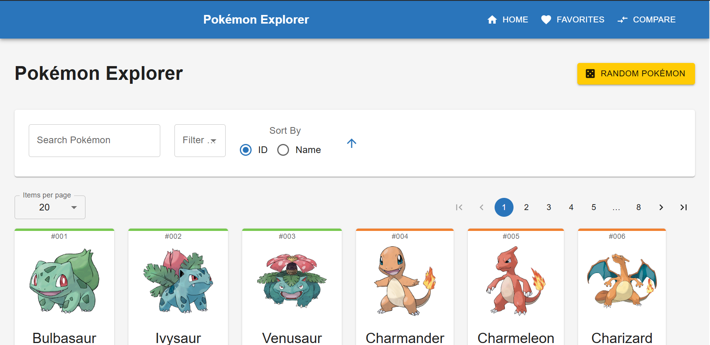

# 🧩 Interactive Pokémon Data Explorer

A feature-rich, responsive React application built with **Vite** and **Material-UI (MUI)** that fetches and displays data for the first 150 Pokémon using the [PokeAPI](https://pokeapi.co/). Users can **search**, **filter**, **sort**, **favorite**, and explore **detailed stats** and **evolution chains** of Pokémon.

---

## 🌐 Live Demo

👉 **[View Deployed App on Vercel](https://pokemon-explorer-alpha.vercel.app/)**

---

## 📸 Screenshots

---

## 🚀 Features

### 🔍 List View Enhancements

- 🔎 **Real-time search** by Pokémon name
- 🧪 **Multi-type filtering** (e.g., Fire & Flying)
- 🔢 **Pagination** (10 / 20 / 50 Pokémon per page)
- 🔁 **Sorting** by ID, name, or alphabetically
- 📄 **Card layout** showing:
  - Name
  - Sprite Image
  - Type(s)
  - ID Number

### 📘 Detailed Pokémon View

- 📊 Complete stat breakdown (HP, Attack, Defense, etc.)
- ✨ Abilities and Move list
- 🧬 Evolution chain display
- 🔗 Seamless routing between list and detail pages

### ⭐ Favorites System

- ❤️ Mark/unmark Pokémon as favorites
- 📁 View all favorite Pokémon in a dedicated section
- 💾 Favorites stored in `localStorage` (persistent across sessions)

### 🛠️ Advanced Tools

- ⚖️ **Compare Tool** – Compare stats of any two Pokémon
- 🎲 **Random Pokémon** button – Instantly jump to a random Pokémon
- ⚙️ Graceful handling of:
  - Loading states
  - No results
  - API errors
  - Broken images

---

## 🧠 Technical Highlights

### 🧰 Tech Stack

- **React + Vite**
- **Material-UI (MUI)**
- **React Router**
- **React Context API** (for global state: favorites, filters, etc.)
- **PokeAPI**
- **Vercel** for deployment

### ⚙️ Architecture & Optimizations

- 🧱 Modular folder structure:
- 🔄 Custom hooks (`usePokemon`, `useFavorites`, etc.)
- ⚡ Performance optimizations with `useMemo`, `useCallback`
- 🚫 Error boundaries to prevent app crashes
- 🌍 Routing with React Router (List, Detail, Favorites, Compare views)

---

## 🙌 Acknowledgements

- PokeAPI – for the Pokémon data

- Material-UI – for UI components

- Vercel – for hosting

---

## Built with ❤️ by [sammy0318](https://github.com/sammy0318)
